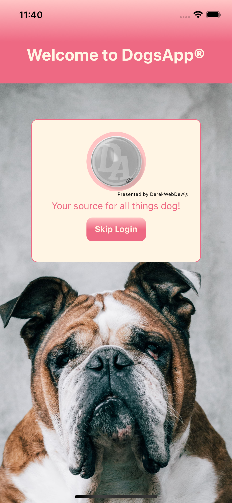

# Dog App

# Dog API App. React Native Mobile Client, Typescript, Custom Hooks, Web View, Camera and Read/Write Storage Permissions. iOs + Android

<video>

# This app does not use Expo runs natively on respective device.

DogApp allows dog lovers to browse their favorite breeds and take pictures or upload from Photo Library dog pictures.

This project uses the following technologies:

- [React Native](https://reactnative.dev/) and [React Navigation](https://reactnavigation.org/) for mobile frontend iOs & Android
- [Yarn](https://yarnpkg.com/) and [Node.js](https://nodejs.org/en/) as the package manager
- [TypeScript](https://www.typescriptlang.org/) for maintaining consistency throughout the code base
- [Xcode](https://developer.apple.com/xcode/) With an all-new design that looks great on macOS Big Sur, Xcode 12 has customizable font sizes for the navigator, streamlined code completion, and new document tabs. Xcode 12 builds Universal apps by default to support Mac with Apple Silicon, often without changing a single line of code.
- [Android Studio](https://developer.android.com/studio/?gclid=CjwKCAjw07qDBhBxEiwA6pPbHpRPUCuKe-jtdsdpeUtfBDBLBXdoFiF-EcwrFwJwc2QE0NQ4dG6IjhoCboUQAvD_BwE&gclsrc=aw.ds) Android Studio provides the fastest tools for building apps on every type of Android device.

## Configuration

Please ensure you have all the above dependencies installed on your system including both Android Studio and Xcode w/Simulator for Mac or just Android Studio for Windows and Linux [React Native Environment Setup](https://reactnative.dev/docs/environment-setup)

## Quick Start:

// Yarn Install and pod-install run android and ios.
cd rootDirectory && yarn all

